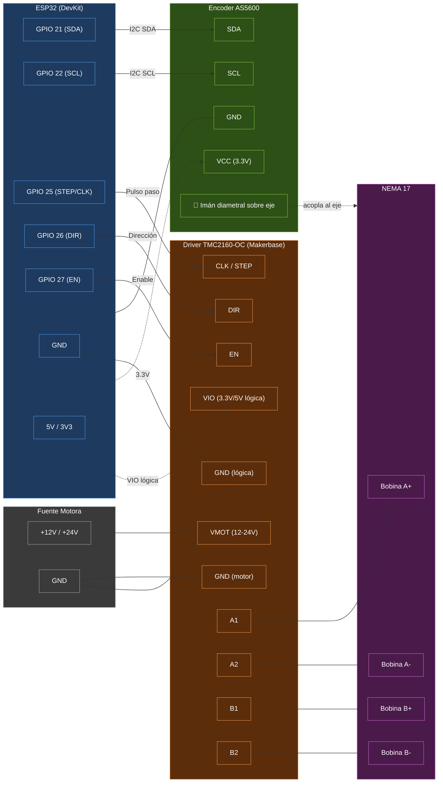

```mermaid
flowchart LR
    subgraph ESP32["ESP32 (DevKit)"]
        GPIO21["GPIO 21 (SDA)"]
        GPIO22["GPIO 22 (SCL)"]
        GPIO25["GPIO 25 (STEP/CLK)"]
        GPIO26["GPIO 26 (DIR)"]
        GPIO27["GPIO 27 (EN)"]
        GND1["GND"]
        V5["5V / 3V3"]
    end

    subgraph AS5600["Encoder AS5600"]
        SDA["SDA"]
        SCL["SCL"]
        VCC_A["VCC (3.3V)"]
        GND_A["GND"]
        MAG["🧲 Imán diametral sobre eje"]
    end

    subgraph TMC["Driver TMC2160-OC (Makerbase)"]
        CLK["CLK / STEP"]
        DIR["DIR"]
        EN["EN"]
        GND_T["GND (lógica)"]
        VIO["VIO (3.3V/5V lógica)"]
        VM["VMOT (12-24V)"]
        GND_M["GND (motor)"]
        A1["A1"]
        A2["A2"]
        B1["B1"]
        B2["B2"]
    end

    subgraph NEMA["NEMA 17"]
        CA1["Bobina A+"]
        CA2["Bobina A-"]
        CB1["Bobina B+"]
        CB2["Bobina B-"]
    end

    subgraph PSU["Fuente Motora"]
        VMO["+12V / +24V"]
        GM["GND"]
    end

    %% I2C AS5600
    GPIO21 -->|I2C SDA| SDA
    GPIO22 -->|I2C SCL| SCL
    V5 -.->|3.3V| VCC_A
    GND1 --- GND_A

    %% Control TMC2160
    GPIO25 -->|Pulso paso| CLK
    GPIO26 -->|Dirección| DIR
    GPIO27 -->|Enable| EN
    GND1 --- GND_T
    V5 -.->|VIO lógica| VIO

    %% Potencia
    VMO --- VM
    GM --- GND_M
    GM --- GND_T

    %% Motor
    A1 --- CA1
    A2 --- CA2
    B1 --- CB1
    B2 --- CB2

    %% Imán
    MAG -.->|acopla al eje| NEMA

    classDef esp fill:#1e3a5f,stroke:#4a90d9,color:#fff
    classDef enc fill:#2d5016,stroke:#7cb342,color:#fff
    classDef drv fill:#5c2d0a,stroke:#d98a4a,color:#fff
    classDef mot fill:#4a1a4a,stroke:#c060c0,color:#fff
    classDef psu fill:#3a3a3a,stroke:#999,color:#fff

    class ESP32,GPIO21,GPIO22,GPIO25,GPIO26,GPIO27,GND1,V5 esp
    class AS5600,SDA,SCL,VCC_A,GND_A,MAG enc
    class TMC,CLK,DIR,EN,GND_T,VIO,VM,GND_M,A1,A2,B1,B2 drv
    class NEMA,CA1,CA2,CB1,CB2 mot
    class PSU,VMO,GM psu
```
